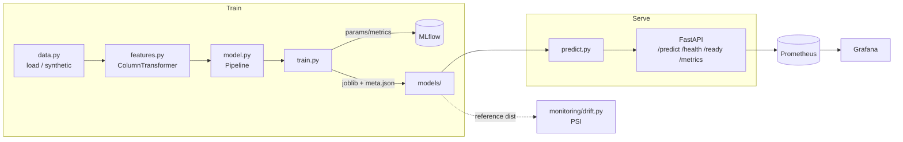

# Capstone 1 — Customer Churn Prediction (Telco)

> Course section **5 — Machine Learning Fundamentals**

A production-grade **tabular binary classification** service that predicts whether
a Telco customer will churn. It ships the full platform blueprint: typed config,
a scikit-learn training pipeline with **MLflow** tracking, a **FastAPI** service
with `/health` · `/ready` · Prometheus `/metrics`, a **PSI** data-drift monitor,
an offline-green **pytest** suite, **Docker + docker-compose**, **Kubernetes**
manifests, a **Terraform** skeleton, and **GitHub Actions** CI.

## Why

Churn is the canonical tabular-ML problem: a mix of numeric + categorical
features, class imbalance, and a need for calibrated probabilities and drift
monitoring in production. This capstone shows the *whole* lifecycle — data →
features → model → serving → monitoring — not just a notebook.

## Architecture



## Data

`data.py` reads a CSV at `CHURN_DATA_PATH` if present, otherwise
`generate_synthetic(n)` produces a deterministic, **learnable** Telco-style
dataset (logit over contract, payment method, tenure, charges, etc.) so the
model scores well above 0.5 AUC offline with no downloads.

Features: `tenure`, `monthly_charges`, `total_charges`, `num_services`,
`senior_citizen` (numeric) + `contract`, `payment_method`, `internet_service`,
`paperless_billing`, `gender` (categorical).

## Model

`model.py` builds a sklearn `Pipeline(preprocess + classifier)`. Default
classifier is **GradientBoostingClassifier** (or LogisticRegression) so the base
deps suffice. **XGBoost** is an *optional* dependency (`pip install '.[ml]'`,
`CHURN_CLASSIFIER=xgboost`) imported lazily.

## Quickstart

```bash
make setup          # venv + install -e ".[dev]"
make train          # train, log to MLflow (./mlruns), save models/churn-model.joblib
make test           # pytest (offline-green; integration skipped)
make serve          # uvicorn on :8000
make drift          # PSI drift demo
make compose-up     # api + mlflow + prometheus + grafana
```

Train without MLflow: `python -m churn.train --no-mlflow`.

## API

| Method | Path       | Description                              |
|--------|------------|------------------------------------------|
| GET    | `/health`  | liveness                                 |
| GET    | `/ready`   | readiness (model loaded)                 |
| GET    | `/metrics` | Prometheus metrics                       |
| POST   | `/predict` | score a single record **or** a list      |

Single record:

```bash
curl -s localhost:8000/predict -H 'content-type: application/json' -d '{
  "tenure": 2, "monthly_charges": 95.0, "total_charges": 190.0,
  "num_services": 2, "senior_citizen": 1, "contract": "month-to-month",
  "payment_method": "electronic-check", "internet_service": "fiber-optic",
  "paperless_billing": "yes", "gender": "female"
}'
# -> {"predictions":[{"churn_probability":0.78,"churn_label":1}],"count":1}
```

Batch: POST a JSON **array** of records to the same endpoint.

## Drift monitoring

`monitoring/drift.py` computes the **Population Stability Index** per numeric
feature between a reference and current distribution:

```bash
python monitoring/drift.py --reference ref.csv --current new.csv --threshold 0.25
```

PSI guide: `<0.1` stable · `0.1–0.25` moderate · `>0.25` significant (retrain).

## Layout

```
src/churn/     config · logging · data · features · model · train · predict · api/
tests/         data · pipeline · api · drift  (pytest, offline-green)
conf/          config.yaml consumed by typed Settings
monitoring/    prometheus.yml · grafana-dashboard.json · drift.py (PSI)
k8s/           deployment · service · configmap · hpa
infra/         terraform skeleton (validate-only)
Dockerfile · docker-compose.yml · Makefile · pyproject.toml · .github/workflows/ci.yml
```

_← [Về danh sách capstone](../README.md)_
