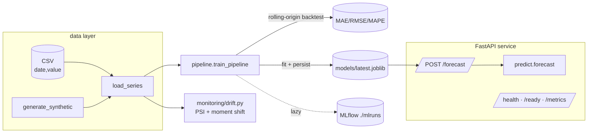

# Capstone 2 — Time-Series Forecast (Vietnam retail / stock)

> Section 6 · Time Series · part of the [ai-portfolio capstones](../README.md)

Production-grade **daily time-series forecasting** service for Vietnam
retail-sales or a VN stock close price. Univariate forecasting with optional
calendar/seasonal structure, a **pluggable model interface**, **rolling-origin
backtesting**, MLflow tracking, a FastAPI service, and data-drift monitoring.

The default model is a dependency-light **seasonal-naive + linear-trend
baseline** (numpy/scikit-learn) so the whole thing runs and tests offline.
SARIMA (statsmodels), Prophet, and a small LSTM (torch) are **optional** and
**lazily imported** — if their library is missing the model degrades gracefully
back to the baseline.

## Architecture



### Models (pluggable via `model_name`)

| name | deps | notes |
|------|------|-------|
| `baseline` | base | seasonal-naive + OLS linear trend (default, tests) |
| `naive_seasonal` | base | repeats the last season |
| `sarima` | `[ml]` statsmodels | SARIMAX; falls back to baseline if unavailable |
| `prophet` | `[ml]` prophet | additive model; falls back to baseline |
| `lstm` | `[ml]` torch | tiny LSTM on a lookback window; falls back to baseline |

## Quickstart

```bash
make setup            # venv + base/dev deps (light, offline-friendly)
make test             # pytest — green offline with the baseline model
make train            # backtest + fit + save models/latest.joblib (+ MLflow)
make serve            # uvicorn on :8000
make drift            # PSI / moment-shift drift report on the series
```

Optional heavy models:

```bash
.venv/bin/pip install -e ".[ml]"
FORECAST_MODEL_NAME=sarima .venv/bin/python -m forecast.train
```

## API

```bash
curl localhost:8000/health
curl localhost:8000/ready
curl -s -X POST localhost:8000/forecast \
     -H 'content-type: application/json' \
     -d '{"horizon": 14}' | jq
```

Response shape:

```json
{
  "model_name": "baseline",
  "horizon": 14,
  "points": [
    {"date": "2024-01-01", "yhat": 1234.5, "yhat_lower": 1180.2, "yhat_upper": 1288.8}
  ]
}
```

`GET /metrics` exposes Prometheus metrics (scraped by `monitoring/prometheus.yml`).

## Configuration

Typed `Settings` (pydantic-settings) read `conf/config.yaml` then env vars with
the `FORECAST_` prefix (see `.env.example`). Key knobs: `model_name`,
`season_length`, `horizon`, `test_size`, `backtest_folds`, `conf_level`.

## Data

`load_series(path)` reads a `date,value` CSV if present at `FORECAST_DATA_PATH`,
otherwise `generate_synthetic(n_days)` produces a deterministic daily series with
trend + weekly + yearly (Tet) seasonality + noise.

## Layout

```
src/forecast/   config · logging_conf · data · metrics · models · pipeline · train · predict · api/
tests/          test_data · test_pipeline · test_api · test_drift (offline-green)
conf/           config.yaml
monitoring/     prometheus.yml · grafana-dashboard.json · drift.py
k8s/            deployment · service · configmap · hpa
infra/          terraform skeleton (docker provider)
Dockerfile · docker-compose.yml · Makefile · pyproject.toml · .github/workflows/ci.yml
```

## MLflow & monitoring

`make train` logs params + holdout/backtest metrics to a local `./mlruns` store
(`--no-mlflow` to disable; tests call `train_pipeline` directly and never touch
MLflow). `make compose-up` brings up the API plus MLflow, Prometheus, and Grafana.

_← [Back to capstones](../README.md)_
