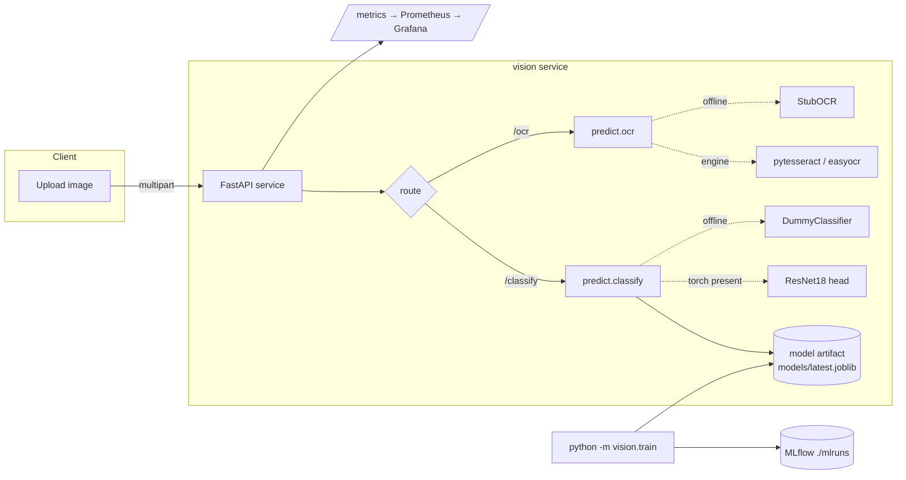

# Capstone 3 — Document Image Classification + Invoice OCR

> Course section 8 (Computer Vision). One FastAPI service with **two**
> capabilities behind it: transfer-learning **image classification** of document
> types and **OCR** + field parsing of invoices.

A production-shaped CV service: typed config, a training pipeline with MLflow
tracking, `/health` · `/ready` · Prometheus `/metrics`, an offline-green pytest
suite, Docker + docker-compose, Kubernetes manifests, a Terraform skeleton, and
a GitHub Actions CI workflow — matching the shared capstone blueprint.

## What & why

Back-office document intake needs to (1) route an uploaded scan to the right
queue (invoice / receipt / id_card / other) and (2) pull structured fields
(total, date, invoice number) off invoices. This capstone does both:

- **Classification** — fine-tunes a torchvision **ResNet18** head over the
  document classes. When torch is absent (CI / laptop), a numpy
  **`DummyClassifier`** (StandardScaler + LogisticRegression over layout-aware
  image features) provides a genuine offline ML path.
- **OCR** — extracts text with **pytesseract** or **easyocr** when available,
  otherwise a deterministic **stub**; regexes parse `total` / `date` /
  `invoice_no`.

Heavy libs (`torch`, `torchvision`, `pytesseract`, `easyocr`, `mlflow`) are
**lazily imported**, so `import vision` and the unit tests run with base deps
only — no GPU, no downloads, no Tesseract binary.

## Architecture



## Project layout

```
src/vision/
  config.py        # typed Settings (pydantic-settings) + DEFAULT_LABELS
  logging_conf.py  # JSON logger
  data.py          # generate_synthetic_image / build/load dataset (image-folder)
  features.py      # preprocess (ImageNet norm) + layout-aware image stats
  model.py         # DummyClassifier + ResNetClassifier (lazy torch)
  ocr.py           # engine resolve + StubOCR + parse_fields (regex)
  pipeline.py      # train_pipeline core: split/fit/score/persist + MLflow
  train.py         # CLI: python -m vision.train
  predict.py       # classify(bytes) / ocr(bytes) used by API + CLI
  api/main.py      # FastAPI app, lifespan loads/trains, instrumentator
monitoring/drift.py  # image-stats PSI drift
```

## Run

```bash
make setup          # venv + pip install -e ".[dev]"  (base deps only)
make test           # pytest, offline-green (DummyClassifier + OCR stub)
make train          # train, log to MLflow (./mlruns), save models/latest.joblib
make serve          # uvicorn on :8000
make compose-up     # api + mlflow + prometheus + grafana
```

Enable the real model paths:

```bash
pip install -e ".[ml]"    # torch + torchvision + mlflow → ResNet18 transfer learning
pip install -e ".[ocr]"   # pytesseract / easyocr (also needs the tesseract binary)
```

## API

| Method | Path        | Body                | Returns |
|--------|-------------|---------------------|---------|
| GET    | `/health`   | —                   | status / app / version |
| GET    | `/ready`    | —                   | model loaded? backend, labels |
| GET    | `/metrics`  | —                   | Prometheus exposition |
| POST   | `/classify` | multipart `file`    | `{label, confidence, probs, backend}` |
| POST   | `/ocr`      | multipart `file`    | `{engine, text, fields}` |

```bash
curl -F "file=@invoice.png" http://localhost:8000/classify
# {"label":"invoice","confidence":0.97,"probs":{...},"backend":"dummy"}

curl -F "file=@invoice.png" http://localhost:8000/ocr
# {"engine":"stub","text":"...","fields":{"total":42.0,"date":"2026-06-04","invoice_no":"INV-2026-0042"}}
```

CLI equivalents:

```bash
python -m vision.predict path/to/img.png          # classify
python -m vision.predict path/to/invoice.png --ocr
python -m monitoring.drift                          # image-stats PSI drift report
```

## Monitoring

`monitoring/drift.py` computes per-feature **PSI** (brightness / contrast / row
variation) plus a brightness moment-shift between a reference and a recent image
batch. Prometheus scrapes `/metrics`; a minimal Grafana dashboard
(`monitoring/grafana-dashboard.json`) charts request rate, p95 latency and 5xx.

## Notes

- Config resolves env (`VISION_*`) over `conf/config.yaml` over field defaults.
- Synthetic images are deterministic per class so tests are reproducible.
- `models/` and `data/` are git-ignored; the API trains a tiny model on first
  run if no artifact exists, so the container is self-sufficient.
