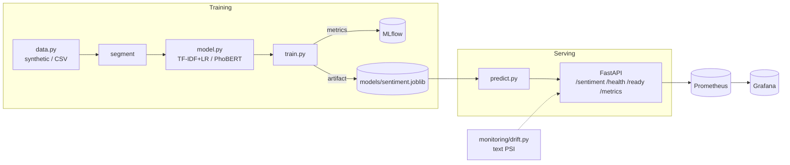

# Capstone 4 — Vietnamese Sentiment Analysis

Classify Vietnamese product-review text into **negative / neutral / positive**.
Part of the [ai-portfolio capstones](../README.md) platform (Section 9 — NLP).

Two model paths share one API and CLI:

1. **TF-IDF + LogisticRegression** (scikit-learn) — the default, fully offline
   path used in tests. Trains in milliseconds on a deterministic synthetic
   Vietnamese review dataset.
2. **PhoBERT** (`transformers` + `underthesea`) — optional transformer path,
   config-selected, with all heavy deps imported lazily.

## Why

Vietnamese is tonal and space-delimited at the *syllable* (not word) level, so
word segmentation matters. The `segment()` helper uses `underthesea` when
available and falls back to a unicode tokenizer otherwise — keeping the default
install light while still wiring up the real NLP path.

## Architecture



## Layout

```
src/nlpvi/
  config.py        typed Settings (pydantic-settings + conf/config.yaml)
  logging_conf.py  JSON logger
  data.py          generate_synthetic / load_data / segment
  model.py         build_model factory (sklearn | phobert)
  train.py         train -> macro-F1 + accuracy + per-class -> models/ (+MLflow)
  predict.py       predict(texts) -> [{label, scores}]
  api/main.py      FastAPI app (lifespan loads/trains model)
monitoring/drift.py  text drift via length + vocabulary PSI
```

## Quickstart

```bash
make setup          # venv + pip install -e ".[dev]"
make test           # pytest, offline-green
make train          # writes models/sentiment.joblib (+ mlruns/)
make serve          # uvicorn on :8000
```

Run without Make:

```bash
python -m venv .venv && source .venv/bin/activate
pip install -e ".[dev]"
PYTHONPATH=src python -m nlpvi.train --no-mlflow
PYTHONPATH=src uvicorn nlpvi.api.main:app --port 8000
```

## API

```bash
curl -s localhost:8000/health
curl -s localhost:8000/ready
curl -s localhost:8000/metrics | head

curl -s -X POST localhost:8000/sentiment \
  -H 'content-type: application/json' \
  -d '{"texts":["Sản phẩm tuyệt vời, giao hàng nhanh","Hàng kém chất lượng, thất vọng"]}'
```

Response:

```json
{
  "predictions": [
    {"label": "positive", "scores": {"negative": 0.02, "neutral": 0.06, "positive": 0.92}},
    {"label": "negative", "scores": {"negative": 0.90, "neutral": 0.07, "positive": 0.03}}
  ],
  "model_version": "20260604..."
}
```

## Configuration

All settings live in `conf/config.yaml` and are overridable via `NLPVI_*` env
vars (see `.env.example`). Switch to the transformer path with:

```bash
pip install -e ".[ml]"
export NLPVI_MODEL_BACKEND=phobert
```

## Drift monitoring

```bash
PYTHONPATH=. python monitoring/drift.py --reference data/ref.csv --current data/live.csv
```

Computes length and vocabulary **PSI** (`<0.1` stable, `0.1–0.25` moderate,
`>0.25` significant) and exits non-zero when drift is flagged.

## Deploy

- **Docker**: `make docker-build && make compose-up` (api + Prometheus + Grafana).
- **Kubernetes**: manifests under `k8s/` (Deployment, Service, ConfigMap, HPA).
- **Terraform**: `infra/` skeleton (`terraform init && terraform validate`).

_← [Về danh sách capstone](../README.md)_
