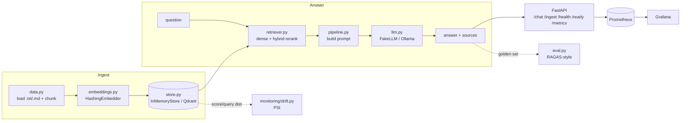

# Capstone 5 — RAG Chatbot over Internal SME Documents

> Course section **12 — RAG & Vector Database**

A production-grade **retrieval-augmented generation (RAG)** chatbot that answers
questions over a company's internal documents (Vietnamese-friendly). It ships the
full platform blueprint: typed config, an ingestion → chunk → embed → index
pipeline, a pluggable **vector store** and **embedder**, a local **Ollama** LLM
behind a swappable client, an offline **RAGAS-style** evaluation, a **FastAPI**
service with `/health` · `/ready` · Prometheus `/metrics`, a **PSI** query-drift
monitor, an offline-green **pytest** suite, **Docker + docker-compose**,
**Kubernetes** manifests, a **Terraform** skeleton, and **GitHub Actions** CI.

## Why

RAG is the canonical pattern for grounding an LLM in private knowledge without
fine-tuning: chunk documents, embed them into a vector store, retrieve the most
relevant passages for a question, and have the LLM answer *with citations*. The
hard parts in production are not the model — they are chunking, retrieval quality
(hybrid dense + lexical), evaluation, and drift monitoring. This capstone shows
the whole lifecycle and runs **fully offline** by default so it is testable on a
laptop with no downloads.

## Architecture



## Pluggable backends (offline by default)

| Component   | Base default (no downloads)     | Optional backend (lazy import)            |
|-------------|---------------------------------|-------------------------------------------|
| Embedder    | `HashingEmbedder` (sklearn)     | `sentence-transformers` (`.[st]`)         |
| Vector store| `InMemoryStore` (numpy cosine)  | `QdrantStore` (`.[qdrant]`)               |
| LLM         | `FakeLLM` (deterministic)       | `OllamaLLM` (local `llama3.1`)            |
| Eval        | RAGAS-style, base deps          | real `ragas` (`.[ragas]`, integration)    |

Select backends via env (`RAGBOT_EMBEDDER`, `RAGBOT_VECTOR_STORE`, `RAGBOT_LLM`)
or `conf/config.yaml`. Heavy libs are imported **lazily** so `import ragbot` and
the unit tests work with base deps only.

## Data

`data.py` loads `.txt`/`.md` files (or every supported file under a directory),
normalises whitespace, and **chunks** with a sliding character window + overlap
(`chunk_size` / `chunk_overlap`) on word boundaries. A small bilingual SME corpus
ships under `data/sample_docs/` (leave policy, refunds, data security,
onboarding) and is mirrored as an in-memory synthetic fallback.

## Retrieval

`retriever.py` embeds the query and does an exact cosine search, then optionally
**hybrid-reranks** by blending the dense score with a BM25-flavoured lexical
overlap score (`hybrid_alpha`). This recovers exact keyword hits that a fuzzy
dense backend might miss.

## LLM

`llm.py` wraps generation behind an `LLMClient` protocol. `FakeLLM` is fully
deterministic (extractive over the retrieved context) and used in **every test**.
`OllamaLLM` calls a local Ollama server (`OLLAMA_BASE_URL`, model `llama3.1`)
over httpx, selected with `RAGBOT_LLM=ollama`.

## Evaluation

`eval.py` is a lightweight **RAGAS-style** offline evaluation (no `ragas`
dependency): context precision/recall (did we retrieve the right source?),
answer groundedness (is the answer supported by context?), and answer relevance.
A golden set is tied to the sample corpus.

```bash
python -m ragbot.eval
```

## Quickstart

```bash
make setup          # venv + install -e ".[dev]"
make ingest         # ingest sample corpus + ask a demo question
make eval           # offline RAGAS-style evaluation
make test           # pytest (offline-green; integration skipped)
make serve          # uvicorn on :8000
make drift          # PSI query-drift demo
make compose-up     # api + qdrant + ollama + prometheus + grafana
```

## API

| Method | Path       | Description                                   |
|--------|------------|-----------------------------------------------|
| GET    | `/health`  | liveness                                      |
| GET    | `/ready`   | readiness (chunks indexed)                    |
| GET    | `/metrics` | Prometheus metrics                            |
| POST   | `/ingest`  | ingest `paths` or inline `documents`          |
| POST   | `/chat`    | ask a question → answer + cited sources       |

Ask a question:

```bash
curl -s localhost:8000/chat -H 'content-type: application/json' -d '{
  "question": "Nhan vien duoc bao nhieu ngay nghi phep?", "top_k": 4
}'
# -> {"answer":"...","sources":[{"rank":1,"source":"chinh_sach_nghi_phep.md",...}],"question":"..."}
```

Ingest inline documents:

```bash
curl -s localhost:8000/ingest -H 'content-type: application/json' -d '{
  "documents": {"faq.md": "Gio lam viec la tu 9h den 18h."}
}'
```

## Drift monitoring

`monitoring/drift.py` computes the **Population Stability Index** over the
incoming **query length** and the **top-1 retrieval-score** distribution. A
sustained shift means traffic no longer resembles the indexed corpus → re-embed
or re-ingest.

```bash
python monitoring/drift.py --reference ref_queries.txt --current new_queries.txt
```

PSI guide: `<0.1` stable · `0.1–0.25` moderate · `>0.25` significant.

## Layout

```
src/ragbot/    config · logging · data · embeddings · store · llm · retriever · pipeline · eval · api/
tests/         data · pipeline · api · drift · integration  (pytest, offline-green)
conf/          config.yaml consumed by typed Settings
data/sample_docs/  bundled bilingual SME corpus (.md)
monitoring/    prometheus.yml · grafana-dashboard.json · drift.py (PSI)
k8s/           deployment · service · configmap · hpa
infra/         terraform skeleton (validate-only)
Dockerfile · docker-compose.yml · Makefile · pyproject.toml · .github/workflows/ci.yml
```

_← [Về danh sách capstone](../README.md)_
