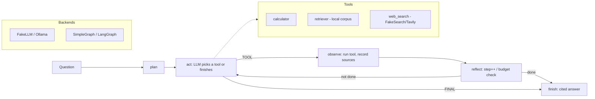

# Capstone 6 — Research Agent (LangGraph)

> Course section 13 (Agentic AI). Part of the `ai-portfolio` capstone platform —
> same structure and conventions as capstones 1–5.

A production-grade **research agent**: given a question, it **plans**, **uses
tools**, and **synthesizes a cited answer**. It runs the classic
`plan -> act -> observe -> reflect -> finish` loop with a bounded step budget.

The agent is **offline-first**: by default it uses a deterministic `FakeLLM`, a
hand-rolled `SimpleGraph` state machine, and a `FakeSearch` tool, so `pytest` and
`import agent` work on a laptop with only the base dependencies. Heavy/optional
backends (`langgraph`, local **Ollama**, a real web-search API) are lazily
imported and selected via config — never touched in tests.

## Why these choices

- **`SimpleGraph` default, `langgraph` optional.** `build_graph()` picks
  `langgraph` when installed (`graph_backend=auto`), otherwise falls back to a
  dependency-free state machine with identical node semantics. Tests stay green
  without `langgraph`.
- **`FakeLLM` default, Ollama optional.** `FakeLLM` deterministically parses tool
  directives and synthesizes an answer from observations. `OllamaLLM` talks to a
  local server via `httpx` only when `llm_backend=ollama`.
- **Real tools.** `calculator` (safe AST arithmetic, no `eval`), `retriever`
  (numpy cosine over a hashing vectorizer across a bundled local corpus),
  `web_search` (`FakeSearch` offline, optional Tavily online).

## Architecture



## Layout

```
src/agent/
  config.py        # typed Settings (env prefix AGENT_) + conf/config.yaml
  logging_conf.py  # JSON logger
  state.py         # AgentState, ToolCall, Source (typed working memory)
  data.py          # local corpus loader (+ synthetic fallback)
  llm.py           # LLMClient protocol, FakeLLM, OllamaLLM, build_llm()
  tools.py         # Tool protocol, registry, calculator/retriever/web_search
  graph.py         # SimpleGraph, langgraph factory, build_graph()
  pipeline.py      # run(question) -> {answer, steps, tool_calls, sources}
  predict.py       # CLI entry point
  api/             # FastAPI app: POST /run, /health, /ready, /metrics
data/corpus/       # bundled .md knowledge docs (agents, rag, evaluation)
monitoring/drift.py# step-count + tool-usage PSI drift checks
```

## Quickstart

```bash
make setup           # venv + base/dev deps
make test            # offline-green pytest
make run             # ask a demo question via the CLI (FakeLLM)
make serve           # FastAPI on :8000
```

Ask the agent from the CLI:

```bash
python -m agent.predict -q "What is 12 * (3 + 4) and what is RAG?"
```

## API

```bash
curl -s localhost:8000/health
curl -s localhost:8000/ready

curl -s -X POST localhost:8000/run \
  -H 'content-type: application/json' \
  -d '{"question": "What is retrieval augmented generation and why cite sources?"}'
```

Response shape:

```json
{
  "question": "...",
  "answer": "...",
  "steps": 2,
  "tool_calls": [{"step": 0, "tool": "retriever", "input": "...", "observation": "..."}],
  "sources": [{"title": "Retrieval Augmented Generation (rag.md)", "snippet": "...", "origin": "retriever"}],
  "backend": "simple"
}
```

## Using a real LLM (Ollama)

```bash
docker compose up -d ollama
docker compose exec ollama ollama pull llama3.1
export AGENT_LLM_BACKEND=ollama
make serve
```

## Monitoring

`monitoring/drift.py` computes **PSI** over the agent's step-count distribution
and tool-usage distribution to catch silent behavioral regressions:

```bash
python monitoring/drift.py        # demo: reference vs. a regressed agent
```

Prometheus scrapes `api:8000/metrics`; a minimal Grafana dashboard ships in
`monitoring/grafana-dashboard.json`.

## Deploy

- **Docker:** `make docker-build && make compose-up` (api + ollama + prometheus + grafana).
- **Kubernetes:** manifests in `k8s/` (Deployment, Service, ConfigMap, HPA).
- **Terraform:** validate-only skeleton in `infra/`.

## Config

All settings come from `conf/config.yaml`, overridable by `AGENT_`-prefixed env
vars (see `.env.example`). Key knobs: `graph_backend`, `llm_backend`,
`search_backend`, `max_steps`, `retriever_top_k`.
