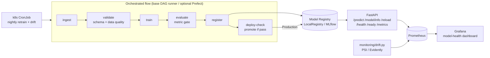

# Capstone 7 — MLOps Platform

> Course section **14 — MLOps & Production**

The **meta** capstone. Instead of one model, this project builds the *platform*
that ties the patterns from capstones 1–6 together: an orchestrated training
**pipeline** (a dependency-free DAG runner, optional Prefect), a versioned
**model registry** with stage transitions (a base-deps `LocalRegistry`, optional
MLflow), a **FastAPI** service that always serves the current **Production**
model, **drift monitoring** (PSI + optional Evidently with a Prometheus exporter),
and the full **infra** blueprint — multi-stage Docker, docker-compose
(api + MLflow + Postgres + Prometheus + Grafana), Kubernetes (deployment, service,
configmap, HPA, scheduled-retrain CronJob), a Terraform skeleton, and a two-stage
GitHub Actions CI/CD.

The reference model is intentionally a small tabular churn classifier — the focus
is the lifecycle around it, not the model.

## Why

Most ML projects die in the gap between a notebook and production: no
orchestration, no model versioning, no safe promotion, no drift signal, no way to
redeploy. This capstone makes that whole loop concrete and runnable offline so the
machinery — not just the model — is the deliverable.

## Architecture



## Components

| Concern        | Default (base deps)                          | Optional (lazy import)        |
|----------------|----------------------------------------------|-------------------------------|
| Orchestration  | `pipeline.runner.Pipeline` (DAG executor)    | Prefect (`MLOPS_PIPELINE_BACKEND=prefect`) |
| Registry       | `registry.LocalRegistry` (joblib + manifest) | MLflow (`MLOPS_REGISTRY_BACKEND=mlflow`)   |
| Drift report   | PSI summary + Prometheus exporter            | Evidently (`pip install '.[evidently]'`)   |
| Tracking store | local files                                  | Postgres-backed MLflow (compose)           |

## Pipeline

`python -m mlops.pipeline run` executes the DAG **ingest → validate → train →
evaluate → register → deploy-check**. Each stage is a plain callable sharing a
context dict; the runner topologically sorts the graph, detects cycles, and stops
on the first failure. `deploy-check` auto-promotes the new version to
**Production** when `roc_auc ≥ MLOPS_MIN_ROC_AUC`, otherwise parks it in
**Staging** for review.

## Registry

`LocalRegistry` stores each version as `registry/<model>/v<N>/model.joblib` plus a
JSON manifest tracking stage transitions (`None → Staging → Production →
Archived`). Promoting a version to Production archives the previous live one, so
exactly one model is serving at a time.

```bash
python -m mlops.registry list
python -m mlops.registry promote 2 --stage Production
python -m mlops.registry current --stage Production
```

## Quickstart

```bash
make setup          # venv + install -e ".[dev]"
make pipeline       # run full flow -> registers + promotes a Production model
make registry-list  # list registered versions
make serve          # uvicorn on :8000 (loads the Production model)
make predict        # score a demo record via the registry
make drift          # PSI / Evidently drift demo (add --prometheus for metrics)
make test           # pytest (offline-green; integration skipped)
make compose-up     # api + mlflow + postgres + prometheus + grafana
```

## API

| Method | Path          | Description                                  |
|--------|---------------|----------------------------------------------|
| GET    | `/health`     | liveness                                     |
| GET    | `/ready`      | readiness (model loaded)                     |
| GET    | `/metrics`    | Prometheus metrics                           |
| GET    | `/model/info` | current model name / version / stage / metrics |
| POST   | `/reload`     | reload current Production model from registry |
| POST   | `/predict`    | score a single record **or** a list          |

```bash
curl -s localhost:8000/predict -H 'content-type: application/json' -d '{
  "tenure": 2, "monthly_charges": 95.0, "total_charges": 190.0,
  "num_services": 2, "senior_citizen": 1, "contract": "month-to-month",
  "payment_method": "electronic-check", "internet_service": "fiber-optic",
  "paperless_billing": "yes", "gender": "female"
}'
# -> {"predictions":[{"churn_probability":0.78,"churn_label":1}],"count":1}
```

After promoting a new version, `POST /reload` swaps the live model with no restart.

## Drift monitoring

`monitoring/drift.py` computes the **Population Stability Index** per numeric
feature. With Evidently installed it also emits a full drift report; otherwise it
falls back to the base-deps PSI summary. `--prometheus` renders gauges
(`model_drift_psi`, `model_drift_detected`, `model_drift_max_psi`) consumed by the
Grafana **model-health** dashboard.

```bash
python monitoring/drift.py --reference ref.csv --current new.csv --threshold 0.25
python monitoring/drift.py --prometheus   # demo, Prometheus exposition text
```

PSI guide: `<0.1` stable · `0.1–0.25` moderate · `>0.25` significant (retrain).

## CI/CD

- **`.github/workflows/ci.yml`** — lint (ruff) + tests (pytest) + docker build,
  paths-filtered to this capstone.
- **`.github/workflows/cd.yml`** — documented **build → push (GHCR) → deploy
  (kubectl rollout)** template, gated on a `production` environment and `main`.

## Layout

```
src/mlops/    config · logging · data · features · model · validation · train · predict · serve
              pipeline/ (DAG runner · flow · optional Prefect · CLI)
              registry/ (LocalRegistry · optional MLflow · CLI)
              api/      (FastAPI: predict · model/info · reload · health · ready · metrics)
tests/        data · validation · pipeline (DAG + flow) · registry · drift · api
conf/         config.yaml consumed by typed Settings
monitoring/   prometheus.yml · grafana-dashboard.json · drift.py (PSI + Prometheus)
k8s/          deployment · service · configmap · hpa · cronjob (scheduled retrain)
infra/        terraform skeleton (validate-only)
Dockerfile · docker-compose.yml · Makefile · pyproject.toml · .github/workflows/{ci,cd}.yml
```

_← [Về danh sách capstone](../README.md)_
